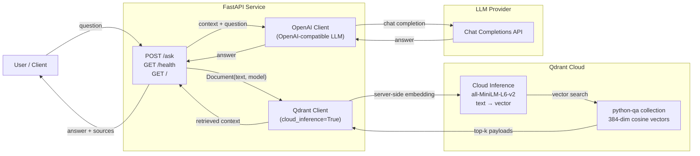

<p align="center">
  <h1 align="center">Python QA RAG Assistant</h1>
  <p align="center">
    Retrieval-Augmented Generation over Stack Overflow Python Q&A
    <br />
    <a href="#architecture"><strong>Architecture</strong></a> ·
    <a href="#setup"><strong>Setup</strong></a> ·
    <a href="#api-reference"><strong>API</strong></a> ·
    <a href="#deployment"><strong>Deployment</strong></a>
  </p>
</p>

<p align="center">
  
  
  
  
</p>

<p align="center">
  <a href="https://huggingface.co/spaces/divakarsingh166/python-qa-rag-assistant">
    
  </a>
</p>

---

## Table of Contents

- [Overview](#overview)
- [Features](#features)
- [Architecture](#architecture)
- [RAG Pipeline Walkthrough](#rag-pipeline-walkthrough)
- [Repository Structure](#repository-structure)
- [Setup](#setup)
  - [Prerequisites](#prerequisites)
  - [Environment Variables](#environment-variables)
  - [Install Dependencies](#install-dependencies)
  - [Ingest Data](#ingest-data)
  - [Run the API](#run-the-api)
- [Docker](#docker)
- [API Reference](#api-reference)
- [Hugging Face Spaces Deployment](#hugging-face-spaces-deployment)
- [Testing & Evaluation](#testing--evaluation)
- [Scaling Considerations](#scaling-considerations)
- [Future Improvements](#future-improvements)
- [Assumptions & Limitations](#assumptions--limitations)

---

## Overview

The **Python QA RAG Assistant** is a retrieval-augmented generation application that answers Python programming questions using a curated corpus of Stack Overflow Q&A pairs. It combines dense vector search via Qdrant Cloud with an LLM to produce grounded, context-aware answers with source attribution.

The system ingests ~175K curated Python Q&A documents, embeds them server-side using Qdrant's cloud inference, and exposes a FastAPI service that retrieves relevant context and generates answers via an OpenAI-compatible LLM.

---

## Features

- **Dense Retrieval** — Semantic search over Stack Overflow Q&A using `all-MiniLM-L6-v2` embeddings (384-dim, cosine distance), computed server-side via Qdrant Cloud Inference.
- **Grounded Generation** — Retrieved documents are passed as context to an LLM (OpenAI-compatible), producing answers that cite the source material.
- **Source Attribution** — Every answer includes the top-5 retrieved sources with relevance scores, titles, and tags.
- **Health Monitoring** — Endpoint exposes Qdrant connectivity status for observability.
- **Web Interface** — Built-in chat UI served from the FastAPI application.
- **Configurable** — All settings (model, chunk size, retrieval count, generation params) managed via environment variables through Pydantic Settings.

---

## Architecture



### How It Works

1. **Ingestion** — The ingestion script reads a curated parquet file of ~175K Stack Overflow Python Q&A documents. For each document, it sends the raw text to Qdrant Cloud, which computes a 384-dimensional embedding using `sentence-transformers/all-MiniLM-L6-v2` and stores both the vector and payload (title, tags, question score, document text) in the `python-qa` collection.

2. **Retrieval** — When a user submits a question via `POST /ask`, the API constructs a Qdrant `Document` object with the question text and the same embedding model name. Qdrant Cloud computes the query embedding server-side and returns the top-5 most similar documents via cosine similarity search.

3. **Augmentation** — The retrieved document texts are joined into a single context block. A system prompt instructs the LLM to answer based solely on the provided context and to indicate when information is insufficient.

4. **Generation** — The context and user question are sent to an OpenAI-compatible LLM endpoint. The LLM generates a grounded answer, which is returned alongside the source documents and their relevance scores.

---

## RAG Pipeline Walkthrough

### 1. Data Curation

A Kaggle Stack Overflow Python Q&A dataset is cleaned and filtered in `notebooks/Data Cleaning.ipynb`:

- HTML stripping from question/answer bodies via BeautifulSoup
- Top-3 answers selected per question (by score)
- Questions filtered to those with `question_score >= 2`
- Final document format:

```
Title: {title}

Tags: {tags}

Question:
{cleaned_question_body}

Top Answers:

Answer 1
Score: {score}

{body}

Answer 2
...
```

Output: `stack_overflow_rag.parquet` with 174,626 rows and columns `Id`, `Title`, `Tags`, `question_score`, `document`.

### 2. Embedding & Indexing

The `app/ingestion.py` script:

- Reads the parquet file
- Creates a Qdrant collection with cosine distance and 384-dim vector config
- Uploads documents in batches of 100, each with `Document(text=..., model="sentence-transformers/all-minilm-l6-v2")` — Qdrant Cloud computes the embedding server-side
- Stores payload fields: `question_id`, `title`, `tags`, `question_score`, `document`

### 3. Query & Generation

At runtime, the `POST /ask` handler:

1. Embeds the user question server-side via Qdrant Cloud Inference
2. Searches the `python-qa` collection with cosine similarity
3. Formats top-5 results into a context block
4. Sends system prompt + context + question to the LLM
5. Returns the generated answer and source metadata

---

## Repository Structure

```
.
├── app/
│   ├── __init__.py
│   ├── api.py                   # FastAPI application (routes, clients, models)
│   ├── ingestion.py             # Qdrant data ingestion script
│   └── static/
│       └── index.html           # Chat UI frontend
├── notebooks/
│   └── Data Cleaning.ipynb      # Data cleaning & document construction
├── tests/
│   └── test_api.py              # Unit Tests
├── evaluation/
│   ├── evaluate.py              # Evaluation Script
│   └── evaluation_results.md    # Evaluation Results
├── config.py                    # Pydantic Settings (env-based configuration)
├── .env.example                 # Environment variable template
├── .python-version              # Python version pinning
├── pyproject.toml               # Project metadata & dependencies
├── uv.lock                      # Lockfile for reproducible installs
└── README.md
```

---

## Setup

### Prerequisites

- Python 3.13+
- [uv](https://docs.astral.sh/uv/) (package manager)
- A [Qdrant Cloud](https://cloud.qdrant.io/) account with a cluster
- An OpenAI-compatible LLM API endpoint (e.g., NVIDIA, Together, OpenAI, local vLLM)

### Environment Variables

| Variable          | Description                      | Default                          |
| ----------------- | -------------------------------- | -------------------------------- |
| `QDRANT_URL`      | Qdrant Cloud cluster URL         | `http://localhost:6333`          |
| `QDRANT_API_KEY`  | Qdrant Cloud API key             | `""`                             |
| `COLLECTION_NAME` | Qdrant collection name           | `python-qa`                      |
| `LLM_API_KEY`     | LLM API key                      | `dummy`                          |
| `LLM_BASE_URL`    | LLM base URL (OpenAI-compatible) | `https://providers-api/v1`       |
| `LLM_MODEL`       | LLM model name                   | `Qwen/Qwen2.5-Coder-7B-Instruct` |

Copy the template and fill in your credentials:

```bash
cp .env.example .env
```

## Dataset

The cleaned dataset is hosted on [Kaggle](https://www.kaggle.com/datasets/divakarsingh166/kaggle-stackoverflow-python-questions-dataset).

Download:

https://www.kaggle.com/api/v1/datasets/download/divakarsingh166/kaggle-stackoverflow-python-questions-dataset

Place the downloaded file at:

data/stack_overflow_rag.parquet

### Install Dependencies

```bash
uv sync
```

### Ingest Data

```bash
mkdir -p data

# download dataset

uv run python app/ingestion.py
```

This reads `data/stack_overflow_rag.parquet`, creates the Qdrant collection, and uploads all documents with server-side embeddings.

### Run the API

```bash
uv run uvicorn app.api:app --host 0.0.0.0 --port 8000
```

Open http://localhost:8000 for the chat interface.

---

## Docker

Build and run:

```bash
docker build -t python-qa-rag .
docker run -p 8000:8000 --env-file .env python-qa-rag
```

---

## API Reference

### `GET /health`

Returns application health and Qdrant connectivity status.

**Response `200`:**

```json
{
  "status": "ok",
  "qdrant": "connected"
}
```

### `POST /ask`

Accepts a Python programming question and returns a grounded answer with sources.

**Request:**

```json
{
  "question": "How do I reverse a list in Python?"
}
```

**Response `200`:**

```json
{
  "question": "How do I reverse a list in Python?",
  "answer": "You can reverse a list using the built-in `reversed()` function or the slice notation `[::-1]`. The `reversed()` function returns an iterator, so you'd wrap it with `list()` to get a list: `list(reversed(my_list))`. The slice approach returns a new list directly: `my_list[::-1]`. Both approaches create a new list; to reverse in-place, use `my_list.reverse()`.",
  "sources": [
    {
      "title": "How to reverse a list in Python?",
      "tags": "python, list",
      "score": 0.814,
      "question_id": 3940128
    }
  ]
}
```

**Response `502` — Retrieval or generation failure:**

```json
{
  "detail": "Retrieval failed: <error details>"
}
```

**Response `404` — No relevant documents:**

```json
{
  "detail": "No relevant documents found"
}
```

### `GET /`

Serves the chat web interface.

---

## Hugging Face Spaces Deployment

The application can be deployed to [Hugging Face Spaces](https://huggingface.co/spaces) using Docker.

1. Create a Space with the **Docker** SDK.
2. Ensure the `Dockerfile` (see [Docker](#docker) section) is at the repository root.
3. Add your environment variables as **Space Secrets**:
   - `QDRANT_URL`
   - `QDRANT_API_KEY`
   - `COLLECTION_NAME`
   - `LLM_API_KEY`
   - `LLM_BASE_URL`
   - `LLM_MODEL`
4. Push your repository to the Space — Hugging Face will build and deploy automatically.

The Space will expose the FastAPI application on the default port. The chat UI at `/` and API at `/ask` and `/health` will be accessible via the Space's URL.

---

## Testing & Evaluation

### Automated Tests

**Unit tests** (`tests/test_api.py`) — 13 fast, deterministic tests that mock Qdrant and LLM clients:

- `GET /` returns the chat UI
- `GET /health` reports connected/unavailable status
- `POST /ask` covers success, 404 (no documents), 502 (retrieval/LLM failure), 422 validation, null payload fields, and empty context

Run with:

```bash
pytest tests/
```

### Evaluation Script

`evaluation/evaluate.py` sends 12 queries (9 normal + 3 edge cases) to `POST /ask` and generates a markdown report at `evaluation/evaluation_results.md` with per-query results and a summary table.

```bash
python evaluation/evaluate.py
```

### Manual Evaluation

The system was manually evaluated against a diverse set of Python-related queries covering:

- **Core language constructs** — decorators, context managers, generators, list comprehensions
- **Standard library** — file I/O, `itertools`, `collections`, `os`/`sys` modules
- **Common tasks** — virtual environments, dependency management, debugging
- **Error patterns** — stack traces, exception handling, debugging techniques
- **Performance** — profiling, optimization, data structures

Each query was submitted via `POST /ask` and evaluated on:

- **Relevance** — Does the answer address the question correctly?
- **Groundedness** — Is the answer supported by the retrieved context?
- **Source accuracy** — Do the cited sources match the answer content?

**Observed behaviors:**

| Scenario                                    | Result                                                                                                   |
| ------------------------------------------- | -------------------------------------------------------------------------------------------------------- |
| Well-covered topic (virtualenv, decorators) | Accurate, grounded answers with relevant sources                                                         |
| Ambiguous question                          | Ambiguous questions may lead to broader or less focused answers.                                         |
| Out-of-scope question (non-Python)          | Retrieval returns unrelated documents; answer quality degrades — handled gracefully by the system prompt |
| Empty or very short query                   | Rejected with 422 validation error (min_length=10)                                                       |
| Qdrant unavailable                          | Returns 502 with descriptive error                                                                       |
| LLM unavailable                             | Returns 502 with descriptive error                                                                       |

---

## Assumptions & Limitations

- **Dataset Scope** — The system only knows about Python topics present in the ingested Stack Overflow subset (~175K questions). It cannot answer questions about other languages or topics not covered.
- **Embedding Quality** — Retrieval relies on a single dense embedding model (`all-MiniLM-L6-v2`). Domain-specific or nuanced queries may not retrieve optimally without hybrid search or fine-tuned embeddings.
- **LLM Groundedness** — While the prompt instructs the LLM to answer from context, the model may occasionally hallucinate or extrapolate beyond the provided sources. Source citations are provided for verification.
- **No Streaming** — Responses are returned in full after generation completes; there is no token-by-token streaming.
- **No Authentication** — The API has no auth layer in its current form. In production, add API key validation or OAuth.
- **Single Collection** — All documents live in one Qdrant collection. Multi-tenancy or categorical routing would require collection-per-strategy or payload-based filtering.
- **No Rate Limiting** — The API does not currently enforce rate limits. A production deployment should add throttling to protect against abuse.
